# (1) creating subject table
```
CREATE TABLE SUBJECT (
    SUBJECT_ID NUMBER PRIMARY KEY,
    SUBJECT_NAME VARCHAR2(50) NOT NULL
);
```
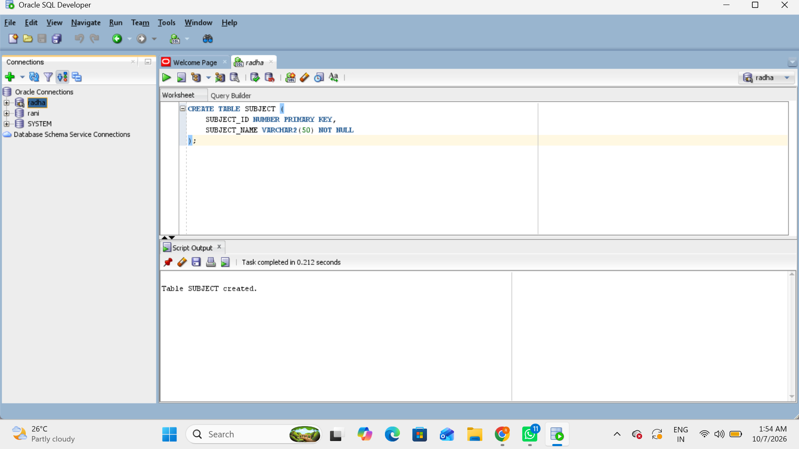
## inserting values
```
INSERT INTO SUBJECT VALUES (1, 'Computer Science');
INSERT INTO SUBJECT VALUES (2, 'Physics');
INSERT INTO SUBJECT VALUES (3, 'Mathematics');
INSERT INTO SUBJECT VALUES (4, 'Chemistry');

COMMIT;
```
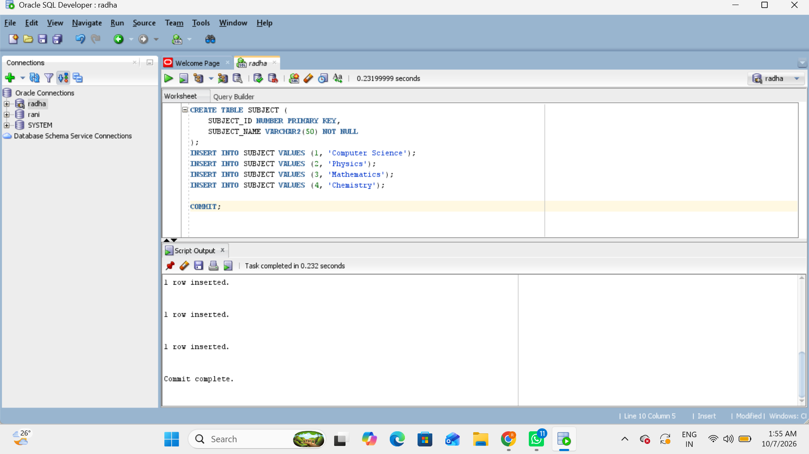
## display
```
SELECT * FROM SUBJECT;
```

# (2) create author table
```
CREATE TABLE AUTHOR (
    AUTHOR_ID NUMBER PRIMARY KEY,
    AUTHOR_NAME VARCHAR2(50) NOT NULL,
    SUBJECT_ID NUMBER,
    
    CONSTRAINT FK_AUTHOR_SUBJECT
    FOREIGN KEY (SUBJECT_ID)
    REFERENCES SUBJECT(SUBJECT_ID)
);
```
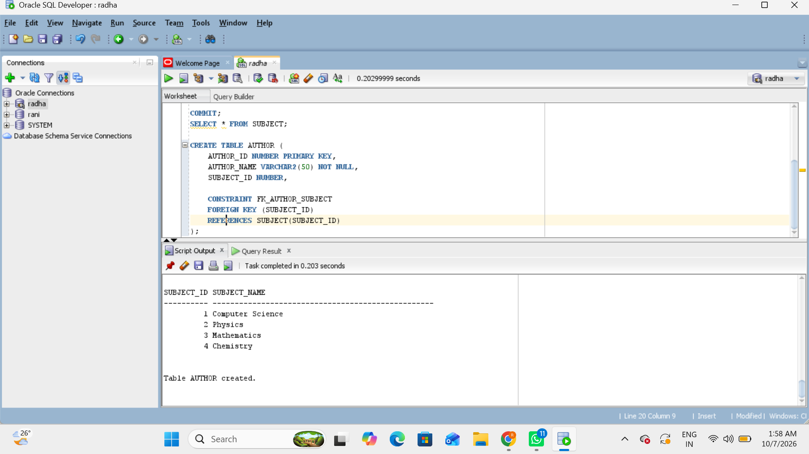
## insertingg
```
INSERT INTO AUTHOR VALUES (101, 'Ravi Kumar', 1);
INSERT INTO AUTHOR VALUES (102, 'Sita Rao', 2);
INSERT INTO AUTHOR VALUES (103, 'Kiran Reddy', 3);
INSERT INTO AUTHOR VALUES (104, 'Anu Sharma', 1);
INSERT INTO AUTHOR VALUES (105, 'Rahul Verma', 4);

COMMIT;
```
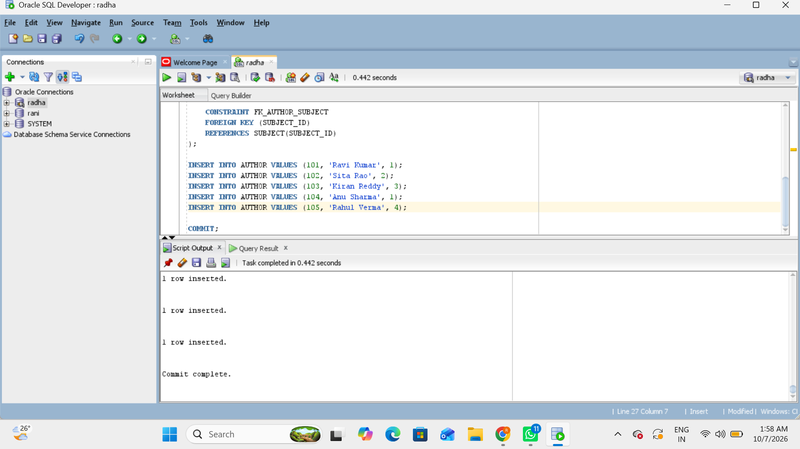
# display
```
SELECT * FROM AUTHOR;
```
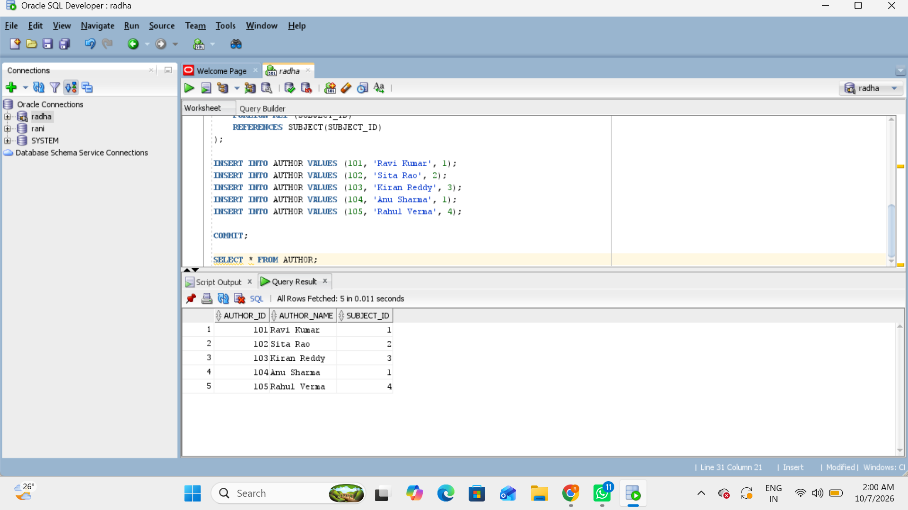
# (3) create editor
```
CREATE TABLE EDITOR (
    EDITOR_ID NUMBER PRIMARY KEY,
    EDITOR_NAME VARCHAR2(50) NOT NULL
);
```
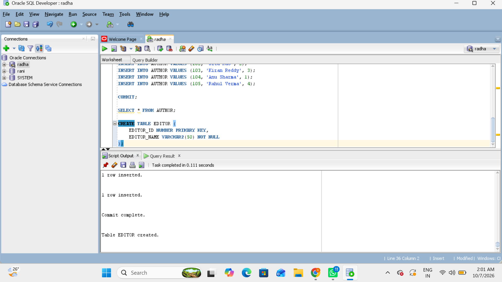
## inserting
```
INSERT INTO EDITOR VALUES (201, 'Editor Kumar');
INSERT INTO EDITOR VALUES (202, 'Editor Priya');
INSERT INTO EDITOR VALUES (203, 'Editor Raj');
INSERT INTO EDITOR VALUES (204, 'Editor Meena');

COMMIT;
```
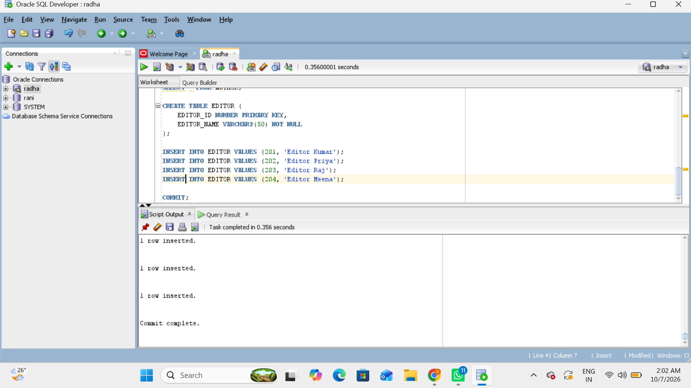
## dispaly
```
SELECT * FROM EDITOR;
```
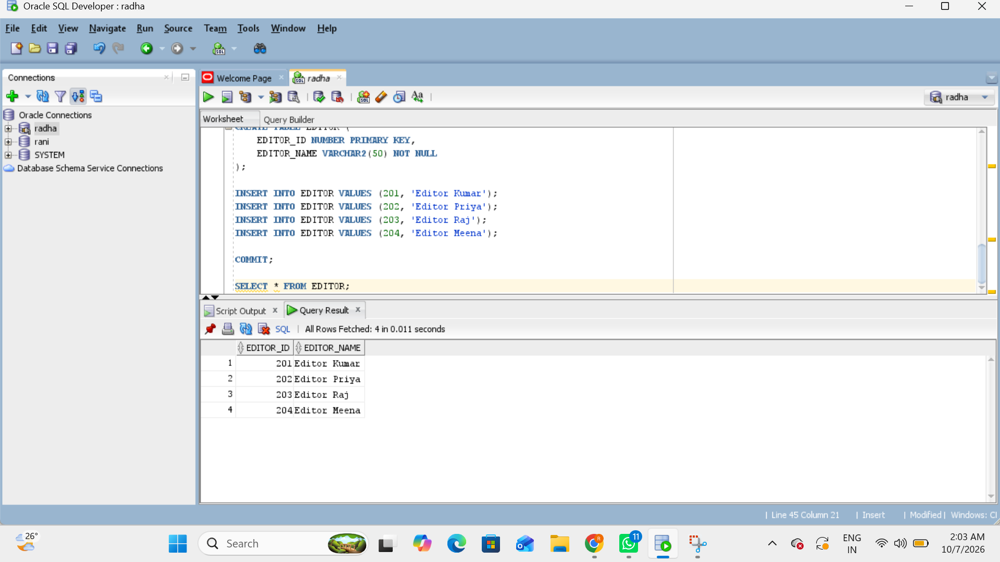

#(4) create publication
```
CREATE TABLE PUBLICATION (
    PUBLICATION_ID NUMBER PRIMARY KEY,
    PUBLICATION_TITLE VARCHAR2(100) NOT NULL,
    AUTHOR_ID NUMBER,
    SUBJECT_ID NUMBER,
    EDITOR_ID NUMBER,

    CONSTRAINT FK_PUBLICATION_AUTHOR
    FOREIGN KEY (AUTHOR_ID)
    REFERENCES AUTHOR(AUTHOR_ID),

    CONSTRAINT FK_PUBLICATION_SUBJECT
    FOREIGN KEY (SUBJECT_ID)
    REFERENCES SUBJECT(SUBJECT_ID),

    CONSTRAINT FK_PUBLICATION_EDITOR
    FOREIGN KEY (EDITOR_ID)
    REFERENCES EDITOR(EDITOR_ID)
);
```
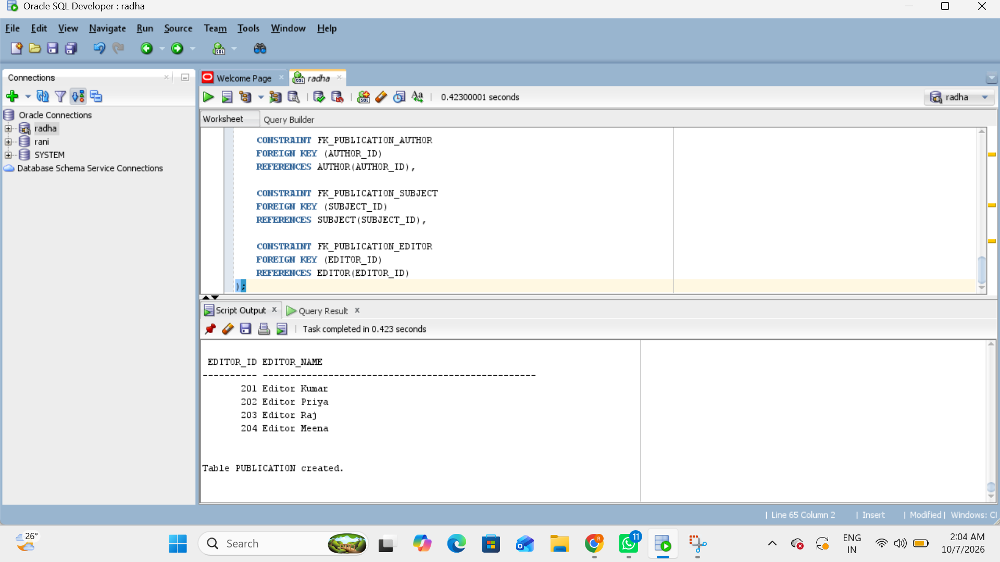

# insert
```
INSERT INTO PUBLICATION
VALUES (301, 'Database Systems', 101, 1, 201);

INSERT INTO PUBLICATION
VALUES (302, 'Modern Physics', 102, 2, 202);

INSERT INTO PUBLICATION
VALUES (303, 'Advanced Mathematics', 103, 3, 203);

INSERT INTO PUBLICATION
VALUES (304, 'Computer Networks', 104, 1, 201);

INSERT INTO PUBLICATION
VALUES (305, 'Organic Chemistry', 105, 4, 204);

COMMIT;
```
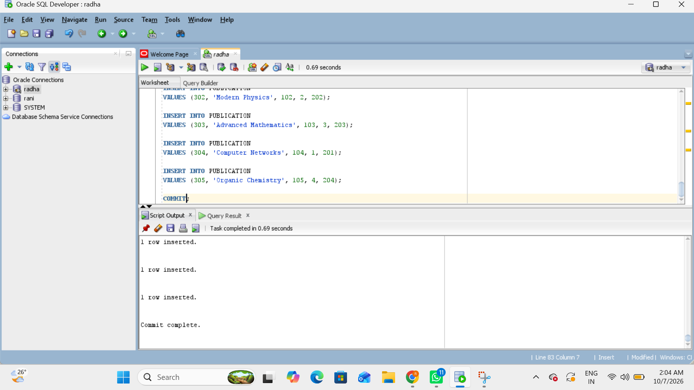

# display
```
SELECT * FROM PUBLICATION;
```
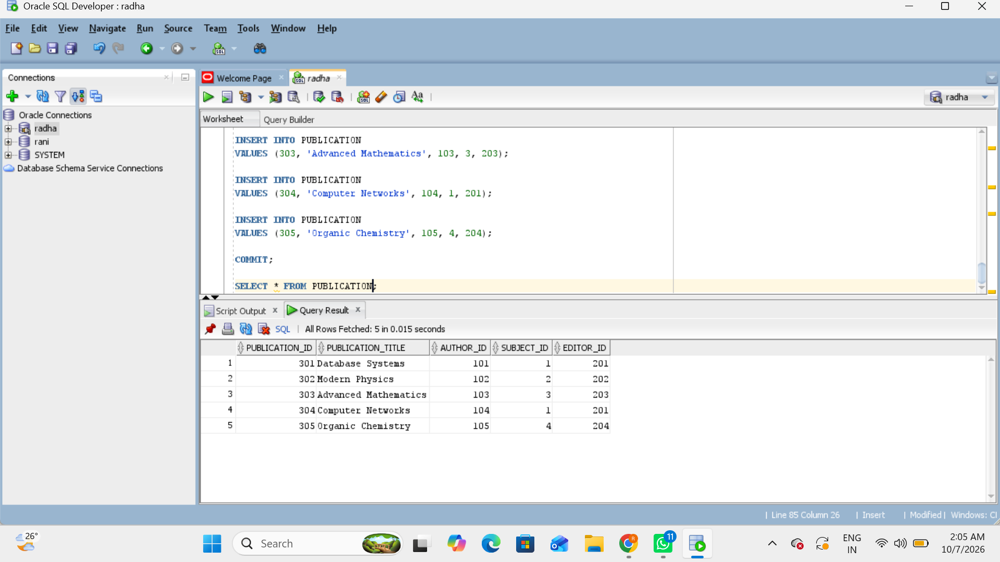


# combined output
```
SELECT
    P.PUBLICATION_ID,
    P.PUBLICATION_TITLE,
    A.AUTHOR_NAME,
    S.SUBJECT_NAME,
    E.EDITOR_NAME
FROM PUBLICATION P
JOIN AUTHOR A
    ON P.AUTHOR_ID = A.AUTHOR_ID
JOIN SUBJECT S
    ON P.SUBJECT_ID = S.SUBJECT_ID
JOIN EDITOR E
    ON P.EDITOR_ID = E.EDITOR_ID
ORDER BY P.PUBLICATION_ID;
```
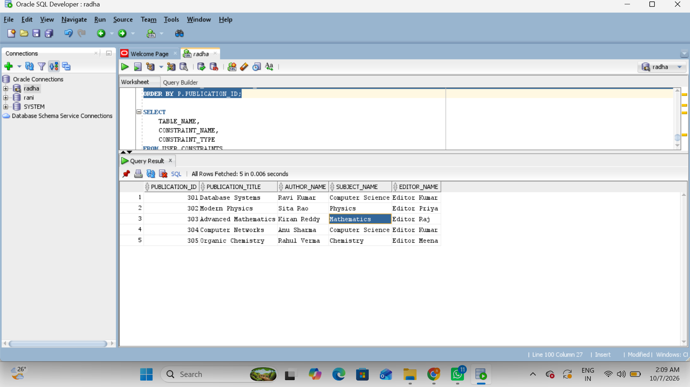

# primary key/foriegn key proof
```
SELECT
    TABLE_NAME,
    CONSTRAINT_NAME,
    CONSTRAINT_TYPE
FROM USER_CONSTRAINTS
WHERE TABLE_NAME IN
('SUBJECT', 'AUTHOR', 'EDITOR', 'PUBLICATION')
ORDER BY TABLE_NAME;
```
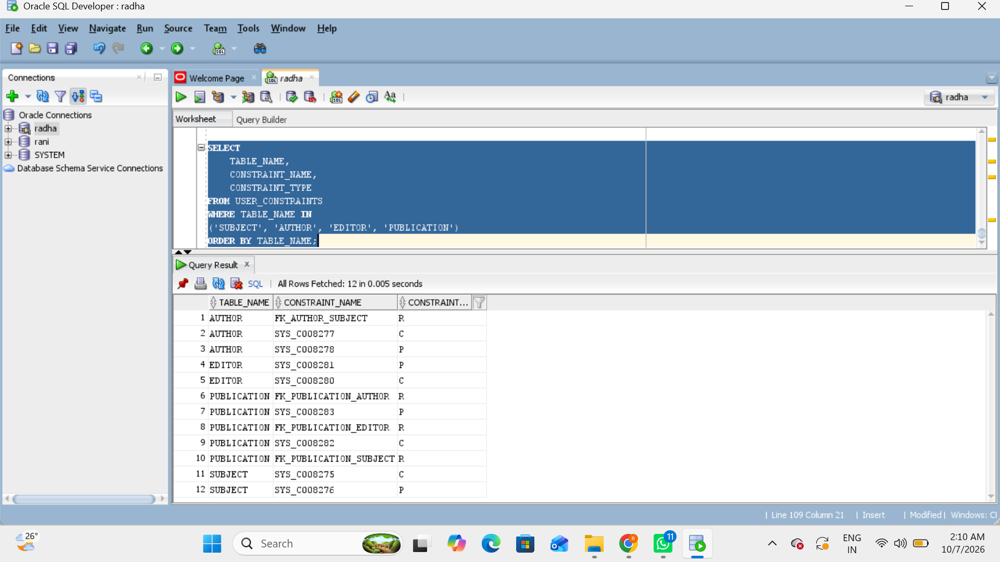
