## EXPERIMENT - 12
## E-COMMERCE DATABASE SYSTEM

# (12) .1. CREATE TABLES
```
CREATE TABLE Customers (
    customer_id NUMBER PRIMARY KEY,
    customer_name VARCHAR2(50),
    email VARCHAR2(50),
    phone VARCHAR2(15),
    address VARCHAR2(100)
);

CREATE TABLE Products (
    product_id NUMBER PRIMARY KEY,
    product_name VARCHAR2(50),
    price NUMBER(10,2),
    category VARCHAR2(30)
);

CREATE TABLE Inventory (
    inventory_id NUMBER PRIMARY KEY,
    product_id NUMBER,
    quantity NUMBER,
    FOREIGN KEY (product_id) REFERENCES Products(product_id)
);

CREATE TABLE Orders (
    order_id NUMBER PRIMARY KEY,
    customer_id NUMBER,
    order_date DATE,
    total_amount NUMBER(10,2),
    FOREIGN KEY (customer_id) REFERENCES Customers(customer_id)
);

CREATE TABLE Order_Items (
    order_item_id NUMBER PRIMARY KEY,
    order_id NUMBER,
    product_id NUMBER,
    quantity NUMBER,
    price NUMBER(10,2),
    FOREIGN KEY (order_id) REFERENCES Orders(order_id),
    FOREIGN KEY (product_id) REFERENCES Products(product_id)
);
```
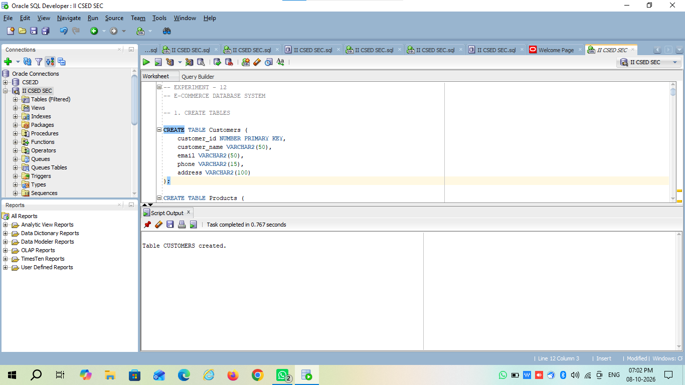
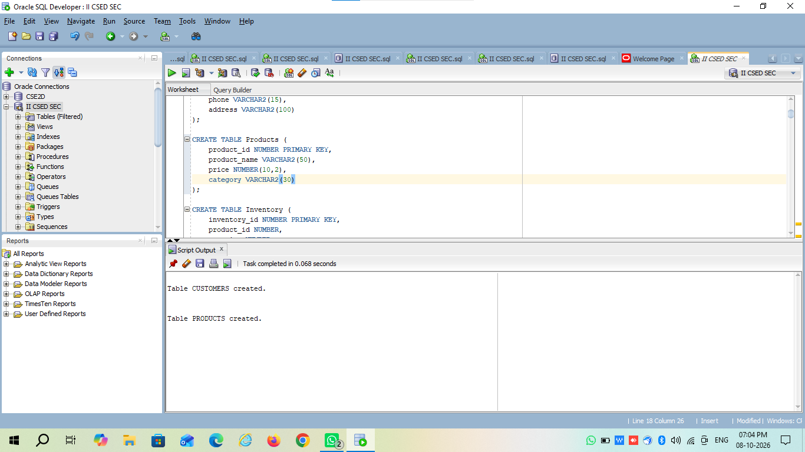
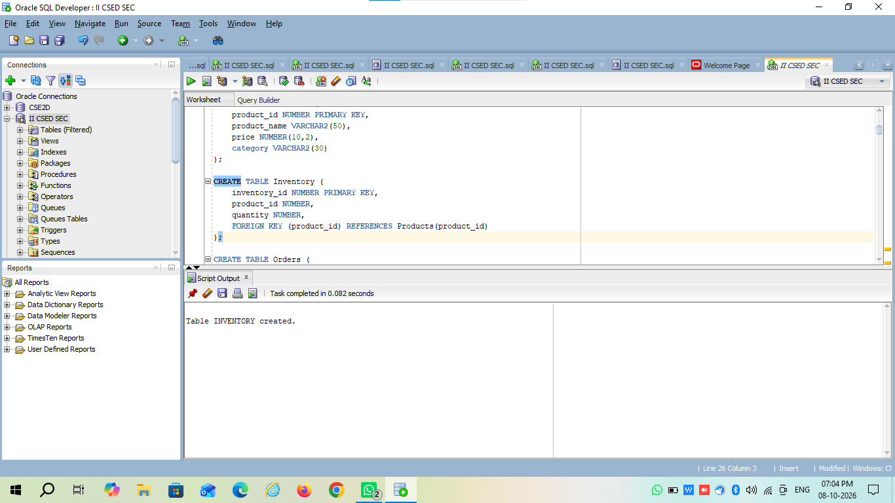
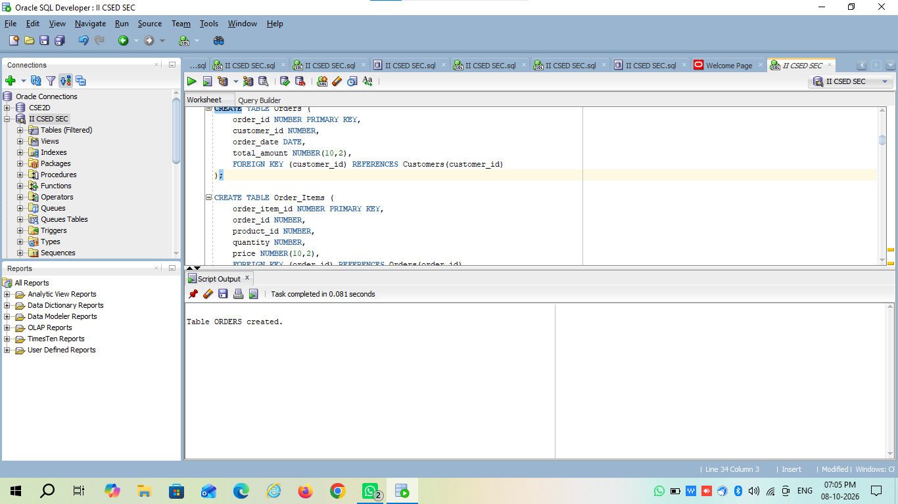
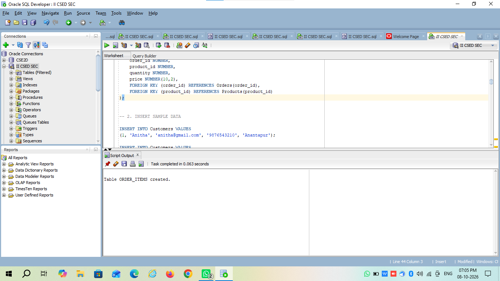


# (12) .2. INSERT SAMPLE DATA
```
INSERT INTO Customers VALUES
(1, 'Anitha', 'anitha@gmail.com', '9876543210', 'Anantapur');

INSERT INTO Customers VALUES
(2, 'Ravi', 'ravi@gmail.com', '9876543211', 'Hyderabad');

INSERT INTO Customers VALUES
(3, 'Sita', 'sita@gmail.com', '9876543212', 'Bangalore');


INSERT INTO Products VALUES
(101, 'Laptop', 55000, 'Electronics');

INSERT INTO Products VALUES
(102, 'Mobile Phone', 20000, 'Electronics');

INSERT INTO Products VALUES
(103, 'Headphones', 1500, 'Accessories');

INSERT INTO Products VALUES
(104, 'Keyboard', 1000, 'Accessories');


INSERT INTO Inventory VALUES
(1, 101, 10);

INSERT INTO Inventory VALUES
(2, 102, 25);

INSERT INTO Inventory VALUES
(3, 103, 50);

INSERT INTO Inventory VALUES
(4, 104, 30);


INSERT INTO Orders VALUES
(1001, 1, DATE '2026-10-01', 56500);

INSERT INTO Orders VALUES
(1002, 2, DATE '2026-10-02', 20000);

INSERT INTO Orders VALUES
(1003, 1, DATE '2026-10-03', 1500);


INSERT INTO Order_Items VALUES
(1, 1001, 101, 1, 55000);

INSERT INTO Order_Items VALUES
(2, 1001, 103, 1, 1500);

INSERT INTO Order_Items VALUES
(3, 1002, 102, 1, 20000);

INSERT INTO Order_Items VALUES
(4, 1003, 103, 1, 1500);

COMMIT;
```
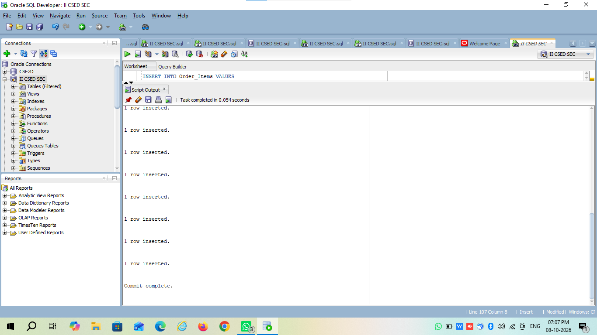


# (12) .3. DISPLAY ALL CUSTOMERS
```
SELECT * FROM Customers;
```
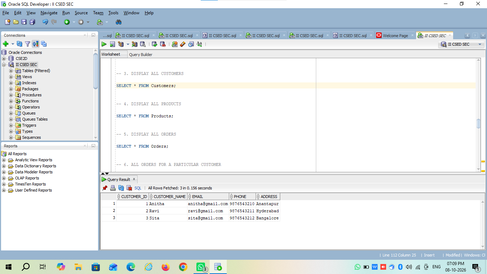

# (12) .4. DISPLAY ALL PRODUCTS
```
SELECT * FROM Products;
```
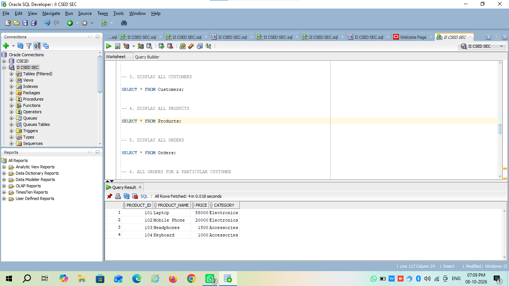

# (12) .5. DISPLAY ALL ORDERS
```
SELECT * FROM Orders;
```
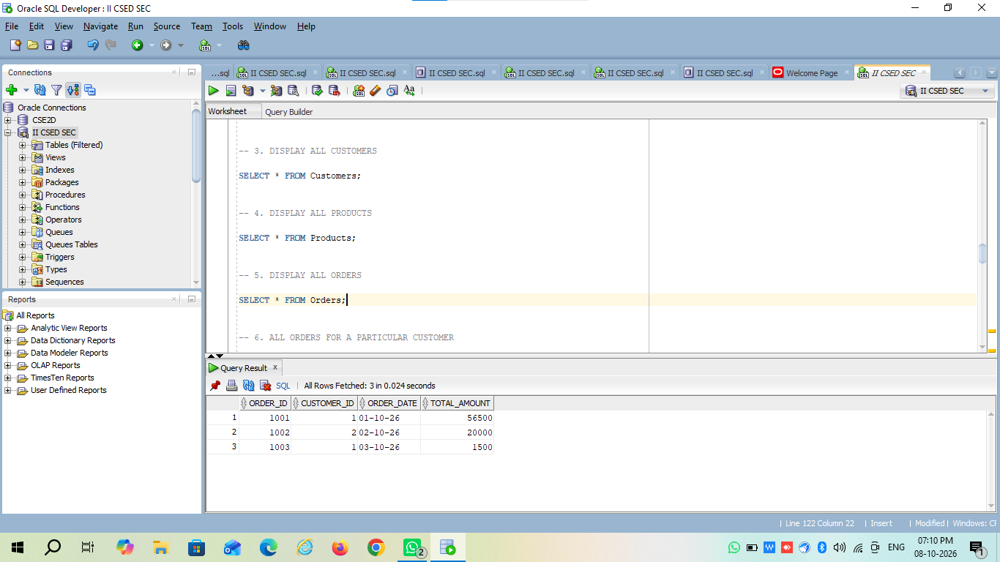

# (12) .6. ALL ORDERS FOR A PARTICULAR CUSTOMER
```
SELECT o.order_id,
       o.order_date,
       o.total_amount
FROM Orders o
JOIN Customers c
ON o.customer_id = c.customer_id
WHERE c.customer_name = 'Anitha';
```
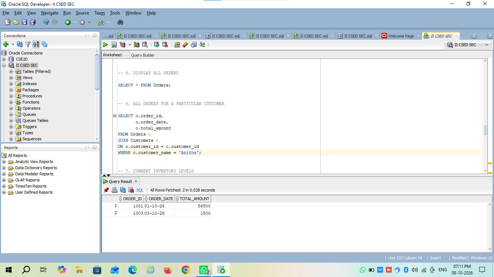


# (12) .7. CURRENT INVENTORY LEVELS
```
SELECT p.product_id,
       p.product_name,
       i.quantity
FROM Products p
JOIN Inventory i
ON p.product_id = i.product_id;
```
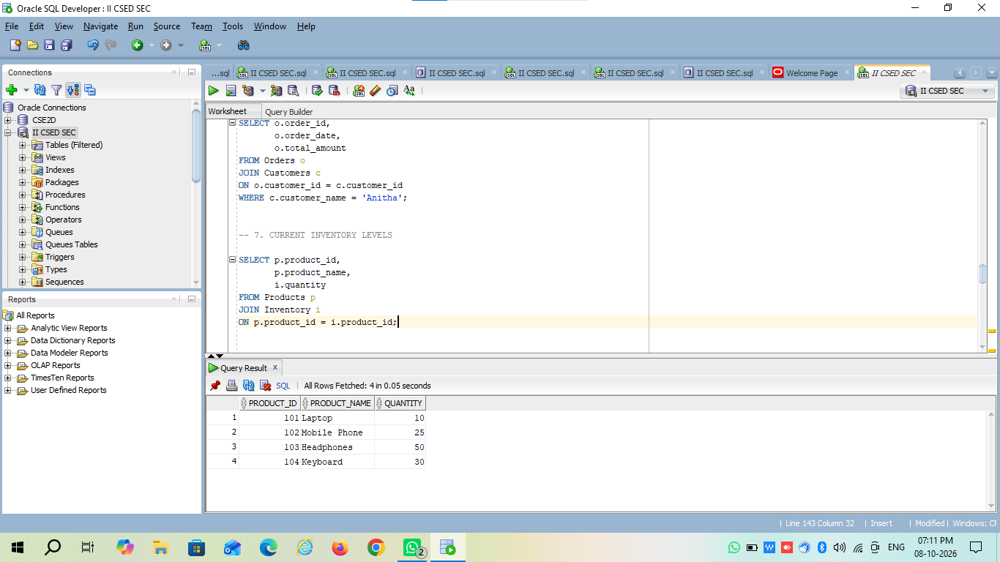


# (12) .8. DISPLAY ORDER DETAILS
```
SELECT o.order_id,
       c.customer_name,
       p.product_name,
       oi.quantity,
       oi.price
FROM Orders o
JOIN Customers c
ON o.customer_id = c.customer_id
JOIN Order_Items oi
ON o.order_id = oi.order_id
JOIN Products p
ON oi.product_id = p.product_id;
```
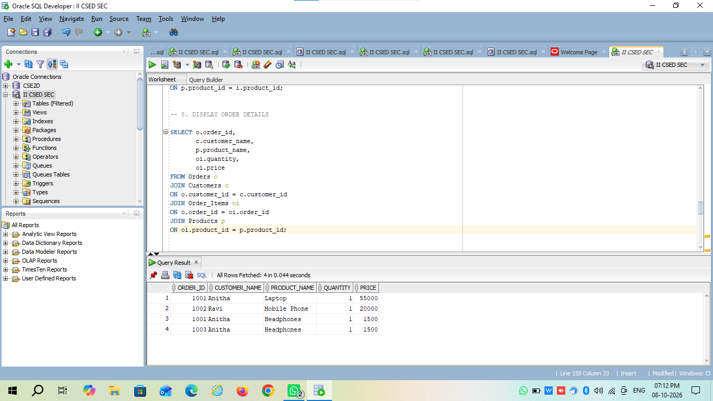


# (12) .9. PRODUCTS WITH PRICE GREATER THAN 10000
```
SELECT *
FROM Products
WHERE price > 10000;
```
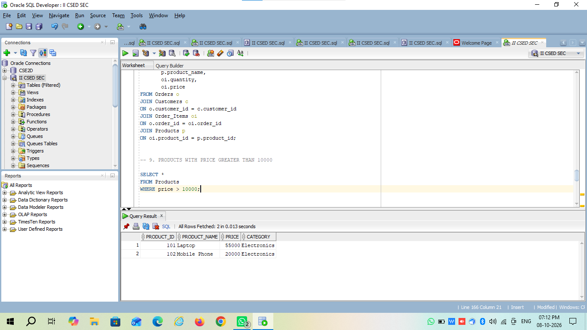

# (12) .10. CREATE VIEW FOR INVENTORY
```
CREATE VIEW Inventory_View AS
SELECT p.product_id,
       p.product_name,
       p.category,
       i.quantity
FROM Products p
JOIN Inventory i
ON p.product_id = i.product_id;
```
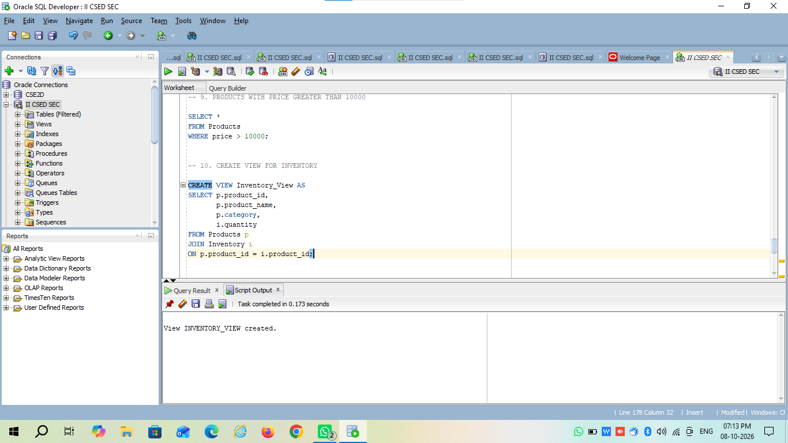

# (12) .11. DISPLAY INVENTORY VIEW
```
SELECT * FROM Inventory_View;
```
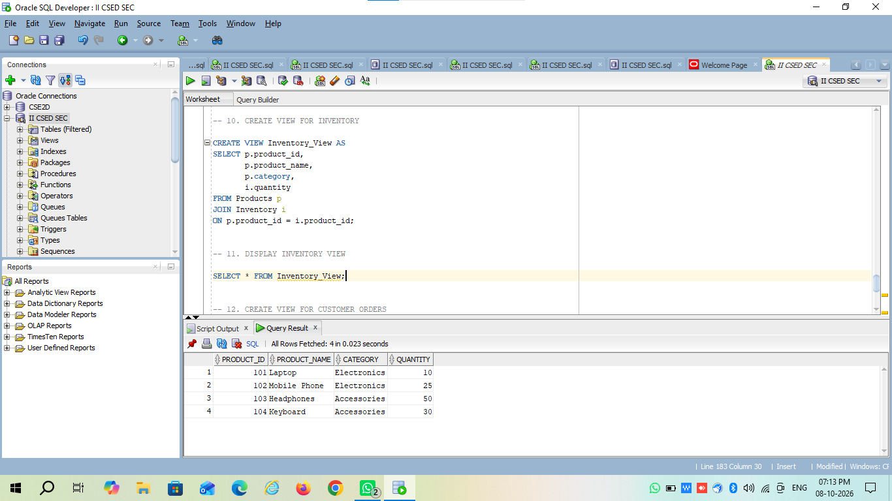

# (12) .12. CREATE VIEW FOR CUSTOMER ORDERS
```
CREATE VIEW Customer_Order_View AS
SELECT c.customer_name,
       o.order_id,
       o.order_date,
       o.total_amount
FROM Customers c
JOIN Orders o
ON c.customer_id = o.customer_id;
```
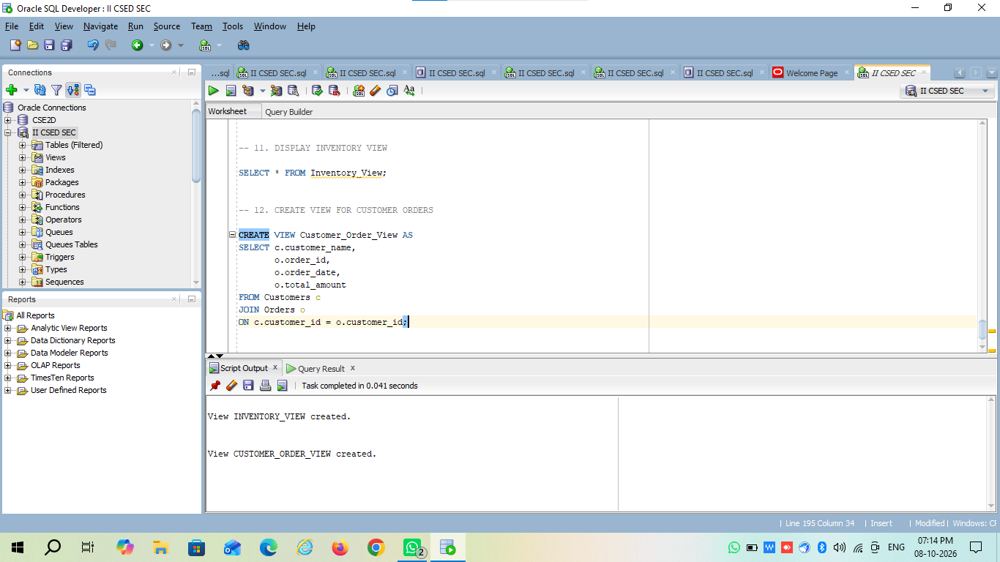

# (12) .13. DISPLAY CUSTOMER ORDER VIEW
```
SELECT * FROM Customer_Order_View;
```
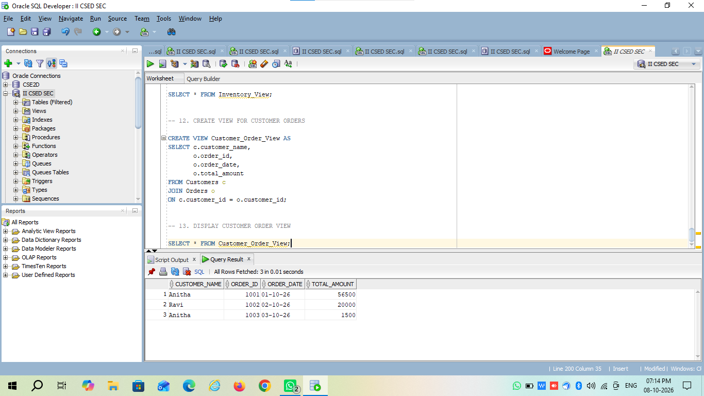

