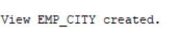

# (3a ) 1.Display employee ID, first name and hire date in DD-MON-YYYY format.

```
SELECT employee_id, first_name,
       TO_CHAR(hire_date, 'DD-MON-YYYY') AS hire_date
FROM EMPLOYEE;

```


# (3a) 2. Display employee ID, first name and salary with currency symbol.

```
SELECT employee_id, first_name,
       TO_CHAR(salary, 'L99999.99') AS salary
FROM EMPLOYEE;
```


# (3a) 3. Add 5000 to each employee's salary using TO_NUMBER.

```
SELECT employee_id, first_name,
       TO_NUMBER(salary) + 5000 AS new_salary
FROM EMPLOYEE;
```


# (3a) 4. Display details of employees hired after 01-JAN-2020.

```
SELECT *
FROM EMPLOYEE
WHERE hire_date > TO_DATE('01-JAN-2020', 'DD-MON-YYYY');
```


# (3a) 5. Display the full name by concatenating first name and last name using ||.

```
SELECT first_name || ' ' || last_name AS full_name
FROM EMPLOYEE;
```

# (3a) 6. Concatenate first name and last name using CONCAT.

```
SELECT CONCAT(first_name, last_name) AS full_name
FROM EMPLOYEE;
```


# (3a) 7. Display first name left-padded with * using LPAD.

```
SELECT LPAD(first_name, 10, '*') AS first_name
FROM EMPLOYEE;
```


# (3a) 8. Display first name right-padded with * using RPAD.

```
SELECT RPAD(first_name, 10, '*') AS first_name
FROM EMPLOYEE;
```

# (3a) 9. Remove leading spaces from first name using LTRIM.

```
SELECT LTRIM(first_name) AS first_name
FROM EMPLOYEE;
```


# (3a) 10. Remove trailing spaces from first name using RTRIM.

```
SELECT RTRIM(first_name) AS first_name
FROM EMPLOYEE;
```


# (3a) 11. Display first names in lowercase.

```
SELECT LOWER(first_name) AS first_name
FROM EMPLOYEE;
```
# (3a) 12. Display first names in uppercase.

```
SELECT UPPER(first_name) AS first_name
FROM EMPLOYEE;
```


# (3a) 13. Display first names in proper case using INITCAP.

```
SELECT INITCAP(first_name) AS first_name
FROM EMPLOYEE;
```


# (3a) 14. Display the length of each employee's first name.

```
SELECT first_name, LENGTH(first_name) AS name_length
FROM EMPLOYEE;
```


# (3a) 15. Display the first three characters of each first name using SUBSTR.

```
SELECT first_name,
       SUBSTR(first_name, 1, 3) AS first_three_chars
FROM EMPLOYEE;
```


# (3a) 16. Find the position of a in each first name using INSTR.

```
SELECT first_name,
       INSTR(LOWER(first_name), 'a') AS position_of_a
FROM EMPLOYEE;
```


# (3a) 17. Display employee details along with the current system date using SYSDATE.

```
SELECT employee_id, first_name, last_name, gender,
       job_id, department, salary, commission,
       hire_date, city, SYSDATE AS current_date
FROM EMPLOYEE;
```


# (3a) 18. Display the next Monday after each employee's hire date.

```
SELECT employee_id, first_name, hire_date,
       NEXT_DAY(hire_date, 'MONDAY') AS next_monday
FROM EMPLOYEE;
```


# (3a) 19. Display the date after adding 6 months to each hire date.

```
SELECT employee_id, first_name, hire_date,
       ADD_MONTHS(hire_date, 6) AS date_after_6_months
FROM EMPLOYEE;
```


# (3a) 20. Display the last day of the month of each employee's hire date.

```
SELECT employee_id, first_name, hire_date,
       LAST_DAY(hire_date) AS last_day_of_month
FROM EMPLOYEE;
```


# (3a) 21. Calculate the total number of months worked using MONTHS_BETWEEN.

```
SELECT employee_id, first_name, hire_date,
       MONTHS_BETWEEN(SYSDATE, hire_date) AS months_worked
FROM EMPLOYEE;
```


# (3a) 22. Display the smaller value between salary and 60000 using LEAST.

```
SELECT employee_id, first_name, salary,
       LEAST(salary, 60000) AS smaller_value
FROM EMPLOYEE;
```


# (3a) 23. Display the greater value between salary and 60000 using GREATEST.

```
SELECT employee_id, first_name, salary,
       GREATEST(salary, 60000) AS greater_value
FROM EMPLOYEE;
```


# (3a) 24. Display the first day of the month of each hire date using TRUNC.

```
SELECT employee_id, first_name, hire_date,
       TRUNC(hire_date, 'MONTH') AS first_day_of_month
FROM EMPLOYEE;
```


# (3a) 25. Round each hire date to the nearest month using ROUND.

```
SELECT employee_id, first_name, hire_date,
       ROUND(hire_date, 'MONTH') AS rounded_month
FROM EMPLOYEE;
```


# (3a) 26. Display hire date in DAY, DD-MON-YYYY format.

```
SELECT employee_id, first_name, hire_date,
       TO_CHAR(hire_date, 'DAY, DD-MON-YYYY') AS formatted_hire_date
FROM EMPLOYEE;
```


# (3a) 27. Display details of employees hired before 01-JAN-2019.

```
SELECT *
FROM EMPLOYEE
WHERE hire_date < TO_DATE('01-JAN-2019', 'DD-MON-YYYY');
```


#(3b) 1.Create a view named EMP_VIEW that displays all columns from the EMPLOYEE table.
```
CREATE VIEW EMP_VIEW AS
SELECT *
FROM EMPLOYEE;
```


#(3b) 2.Create a view named EMP_BASIC that displays Employee ID, First Name, Last Name, Department, and Salary.
```
CREATE VIEW EMP_BASIC AS
SELECT employee_id, first_name, last_name, department, salary
FROM EMPLOYEE;
```


#(3b)  3. Display all records from the EMP_VIEW.
```
SELECT *
FROM EMP_VIEW;
```

# (3b) 4. Create a view named IT_EMPLOYEES for employees working in IT department.
```
CREATE VIEW IT_EMPLOYEES AS
SELECT *
FROM EMPLOYEE
WHERE department = 'IT';
```


#(3b) 5. Create a view named HIGH_SALARY for employees whose salary is greater than ₹60,000.
```
CREATE VIEW HIGH_SALARY AS
SELECT *
FROM EMPLOYEE
WHERE salary > 60000;
```

#(3b) 6. Create a view named HYDERABAD_EMP for employees whose city is Hyderabad.
```
CREATE VIEW HYDERABAD_EMP AS
SELECT *
FROM EMPLOYEE
WHERE city = 'Hyderabad';
```


#(3b) 7. Create a view named FEMALE_EMP for all female employees.

```
CREATE VIEW FEMALE_EMP AS
SELECT *
FROM EMPLOYEE
WHERE gender = 'F';
```


#(3b) 8. Create a view named RECENT_EMPLOYEES for employees hired on or after 01-JAN-2020.
```
CREATE VIEW RECENT_EMPLOYEES AS
SELECT *
FROM EMPLOYEE
WHERE hire_date >= TO_DATE('01-JAN-2020', 'DD-MON-YYYY');
```


#(3b) 9. Display Employee ID, First Name, and Salary from HIGH_SALARY.
```
SELECT employee_id, first_name, salary
FROM HIGH_SALARY;
```


#(3b)10. Replace EMP_BASIC view by adding CITY column.
```
CREATE OR REPLACE VIEW EMP_BASIC AS
SELECT employee_id, first_name, last_name, department, salary, city
FROM EMPLOYEE;
```


#(3b)11. Create a read-only view named EMP_SALARY_VIEW.
```
CREATE VIEW EMP_SALARY_VIEW AS
SELECT employee_id, first_name, last_name, salary
FROM EMPLOYEE
WITH READ ONLY;
```


#(3b)12. Create SALES_EMP view using WITH CHECK OPTION.
```
CREATE VIEW SALES_EMP AS
SELECT *
FROM EMPLOYEE
WHERE department = 'Sales'
WITH CHECK OPTION;

```


#(3b) 13. Update salary of employee 101 through EMP_BASIC view.
```
UPDATE EMP_BASIC
SET salary = 75000
WHERE employee_id = 101;
```


#(3b) 14. Delete employee 107 through EMP_VIEW.
```
DELETE FROM EMP_VIEW
WHERE employee_id = 107;
```


#(3b) 15. Insert a new employee into EMP_BASIC view.
```
Using a sample salary of 50000:
DBMS_Lab_EXPERIMENTs(1-3).pdf
INSERT INTO EMP_BASIC
(employee_id, first_name, last_name, department, salary)
VALUES
(111, 'Ravi', 'Kumar', 'IT', 50000);
```


#(3b) 16. Display the structure of EMP_BASIC.
```
DESC EMP_BASIC;
```


#(3b) 17. Display all records from IT_EMPLOYEES.
```
SELECT *
FROM IT_EMPLOYEES;
```


#(3b) 18. Display employees from HIGH_SALARY whose salary is greater than ₹70,000.
```
SELECT *
FROM HIGH_SALARY
WHERE salary > 70000;
```


#(3b) 19. Display all female employees from FEMALE_EMP.
```
SELECT *
FROM FEMALE_EMP;
```


#(3b) 20. Display names and salaries of employees from HYDERABAD_EMP.
```
SELECT first_name, salary
FROM HYDERABAD_EMP;
```


#(3b) 21. Drop EMP_VIEW.
```
DROP VIEW EMP_VIEW;
```

#(3b) 22. Drop HIGH_SALARY.
```
DROP VIEW HIGH_SALARY;
```


#(3B) 23. Drop EMP_BASIC.
```
DROP VIEW EMP_BASIC;
```

#(3b) 24. Create HR_EMPLOYEES view for HR department employees.
```
CREATE VIEW HR_EMPLOYEES AS
SELECT *
FROM EMPLOYEE
WHERE department = 'HR';
```

#(3b) 25. Create MARKETING_EMP view displaying Employee ID, First Name, Department and Salary.
```
CREATE VIEW MARKETING_EMP AS
SELECT employee_id, first_name, department, salary
FROM EMPLOYEE
WHERE department = 'Marketing';
```


#(3b) 26. Create TOP_EARNERS view for employees earning more than ₹70,000.
```
CREATE VIEW TOP_EARNERS AS
SELECT *
FROM EMPLOYEE
WHERE salary > 70000;

```

#(3b) 27. Create EMP_CITY view displaying Employee ID, First Name, Last Name and City.
```
CREATE VIEW EMP_CITY AS
SELECT employee_id, first_name, last_name, city
FROM EMPLOYEE;
```



